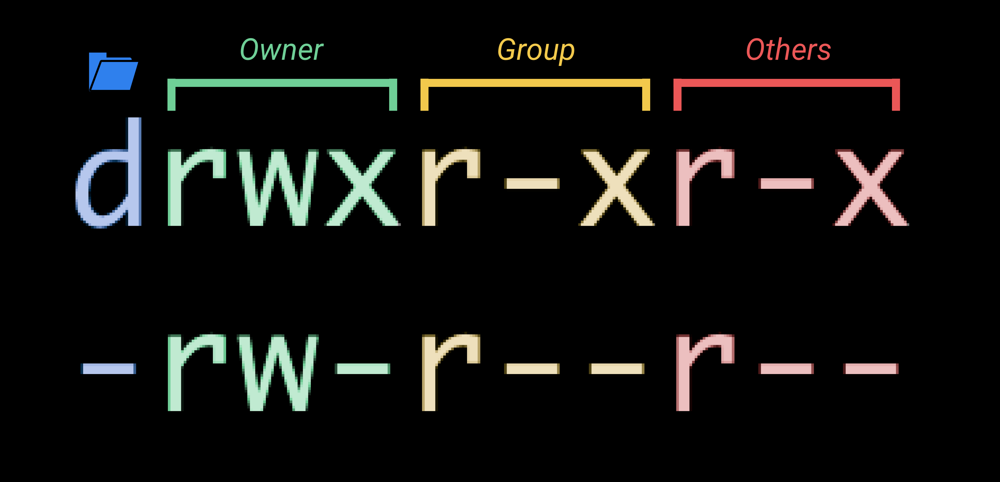

# Intermediate JavaScript and the Command Line (Week 3) - Learning Objectives

## Assessment Structure
- 2 hours 19 minutes (very specific!)
- Mixture multiple choice (25-30), free response (4-6), coding in an online REPL (1-2), and coding problems completed in VSCode and uploaded (8-10).
  - Coding problems will have specs to run (`mocha`) and check your work against
- Standard assesment procedures
  - You will be in an individual breakout room
  - Use a single monitor and share your screen
  - Only have open those resources needed to complete the assessment:
    - Zoom
    - VSCode
    - Browser with AAO and Progress Tracker (to ask questions)
    - Approved Resources for this assessment:
      - Node.js Documentation: https://nodejs.org/en/docs/
      - Git Documentation: https://git-scm.com/docs
      - MDN: https://developer.mozilla.org/en-US/docs/Web/JavaScript

## Asynchronous JavaScript (W3D1) - Learning Objectives

### Asynchronous JS
1. Identify JavaScript as a language that utilizes an event loop model
- The event loop model of JavaScript incorporates two major components: the call stack and the message queue.
- The call stack keeps track of the execution of function calls.
  - When a function calls another function, that new function is placed on the call stack. When this added function completes, it is popped off of the stack and we continue executing the original function that called it.
  - When our call stack is empty, we are able to process a new function that may be waiting for us in our message queue...
- The message queue tracks the handling of events. We utilize the message queue to be able to implement asynchronous code.
  - When a setTimeout's delay expires, for example, we track the event in our message queue.
  - When our call stack is empty (the previous thread of execution ran its course and we are free to execute the next function), the callback from that setTimeout is taken from our message queue and added to the call stack.
  - This waiting for not only the delay to be met but also the call stack to be empty is the reason for us referring to the time as a minimum. If our delay is met but we are still executing functions in our call stack, the callback is not added on until the stack is completely empty.
- The terms `stack` and `queue` are important.
  - A stack is a LIFO structure, meaning as we add new items to it, the newer items are the first to be taken off. It can be thought of like a stack of plates. As we add new functions to the call stack, those newer functions (functions that are invoked by other functions) are executed first before continuing with the execution of the older functions.
  - A queue is a FIFO structure, meaning as we add new items to it, the oldest items are the first to be taken out. It can be though of like waiting in line (or in a queue :) ). As new events are triggered, they are added to the end of our message queue. When our call stack empties, JavaScript evaluates the next function in the queue, ie the one that corresponds to the first event that occurred.

2. Identify JavaScript as a single threaded language
- JavaScript is single-threaded, meaning one command is executed at a time. If a command is currently being executed, a new command that we want to execute will have to wait until the current one has completed.
- We track the current command being executed and those that are waiting to be executed by using the call stack and the message queue.

3. Describe the difference between asynchronous and synchronous code
- Synchronous code is code in which the order of execution is guaranteed.
- Asynchronous code does not have a guaranteed order of execution. One common way asynchronicity is introduced to our code is through a `setTimeout` or `setInterval` function. These functions invoke their callbacks after a minimum delay, either once for `setTimeout` or on a regular interval for `setInterval`.
- In the future we'll see that asynchronous code can also help us when we are communicating with other machines. A response across the web from a server will be handled asynchronously, meaning we won't know exactly when we'll get our answer, but when it makes it to us it'll go into our message queue and handled when our call stack is empty. Something to look forward to!

4. Execute the asynchronous function setTimeout with a callback.
- `setTimeout` takes in two arguments that we are typically concerned with: a callback and a delay.
- The callback is the function that is to be invoked at a later time.
- The delay is the minimum amount of time (in milliseconds) for us to wait before invoking the callback. We say minimum because if a function is already being executed at that time, we must wait for it to finish executing since JavaScript is a single-threaded language and can only perform one command at a time.
- Less common, but definitely useful, `setTimeout` can also take in additional optional arguments to pass to the callback function when it it invoked. This is a similar syntax to how `bind` allows us to pass arguments to a function when it is later invoked.
```js
// A basic example using a defined callback and delay
function sayHi() {
  console.log("Hello world!");
}
setTimeout(sayHi, 1000)

// Using an argument passed to setTimeout to pass along to the callback
function saySomething(phrase){
  console.log("You said: " + phrase);
}
setTimeout(saySomething, 1000, "banana");

// Defining the callback as an anonymous function within setTimeout
setTimeout(() => {
  console.log("I'm an anonymous function! I'm still a callback!")
}, 1000)
```

5. Given the function `function asyncy(cb) { setTimeout(cb, 1000); console.log("async") }` and the function `function callback() { console.log("callback"); }`, predict the output of `asyncy(callback);`
- This may be easier to see as a code block:
```js
function asyncy(cb) {
  setTimeout(cb, 1000);
  console.log("async")
}

function callback() {
  console.log("callback");
}

asyncy(callback);
```
- We know that the first two blocks listed are function declarations, meaning they are not immediately executed. The only code that executes any commands is the final invocation of `asyncy(callback);`.
- Since we are invoking `asyncy`, we step into this function to see what needs to be run next.
- The first line of the function is setting a timeout to invoke our callback function after 1 second. Immediately after setting up this timeout, we console log the string `async`.
- This console log completes the `asyncy` function. If there was any code after our invocation of `asyncy`, it would begin to be run at this point. Since there is none, the only thing left for our program to do is wait for our timeout to elapse.
- After our 1 second has finished, our callback is invoked. `callback` is logged in the console. At this point, our call stack and our message queue are both empty and our program is complete.
```js
// final output:
async
callback
```

6. Use setInterval to have a function execute 10 times with a 1 second period. After the 10th cycle, clear the interval.
- We can implement this functionality multiple ways. We can be strict about how we define the interval or we can define this more dynamically:
```js
// Specifically repeats 10 times, once per second
function repeat10(cb) {
  let count = 0;
  const myInterval = setInterval(() => {
    if (count < 10) {
      count++;
      cb();
    } else {
      console.log("clearing")
      clearInterval(myInterval)
    }
  }, 1000);
}

function sayHi() {
  console.log("Hello world!");
}

repeat10(sayHi);

// Repeats a number of times and at an interval specified by the function
function intervalCount(cb, delay, amount) {
  const interval = setInterval(function() {
    cb();
    amount--;
    if (amount === 0) {
      clearInterval(interval);
    }
  }, delay);
}

intervalCount(sayHi, 1000, 10);
```

7. Write a program that accepts user input using Node’s readline module
- We can take input from a user with the `readline` module. `readline` is part of Node, we just need to require the module so that we can utilize its functionality.
- After pulling in the `readline` module, we can create our interface. In our case, we are setting up a standard interface using the standard input `process.stdin` and standard output `process.stdout`. Running our code in the terminal, this means that we are going to expect the user to type into the terminal for input and we are going to print to the terminal for our output.
- Once our interface is created, we can use the `question` method in order to prompt the user. `question` takes in a string to display to the user (the question we want an input for) as well as a callback. The callback is the function that will be invoked when a user enters their response, and thus captures the response as an argument.
- In the example below, we require the `readline` module, create our interface, then ask the user two questions.
- After the first question, we capture the response as a `name` variable, then ask another question.
- After the second question, we capture the response as a `color` variable. We've gotten all of the input that we need, so we then use the values to print out our response. (You can imagine many other things we can do instead of just console logging, such as responding conditionally based on their input ("I don't like green"), parsing their string inputs into numbers to compare for a guessing game (second project for today), etc.)
```js
const readline = require("readline");

const rl = readline.createInterface({
  input: process.stdin,
  output: process.stdout
});

rl.question("What's your name? ", name => {
  rl.question("What's your favorite color? ", color => {
    console.log("Nice to meet you, " + name + "! I also like the color " + color + "!");
  });
});
```

## Node.js and Git (W3D2) - Learning Objectives

### Node.js 
1. Define NodeJS as distinct from browser based JavaScript runtimes.
- NodeJS is an environment that allows us to execute JavaScript code outside of the browser. There are a couple of differences between the two implementations:
  - global vs window
    - In Node, we have a global object, whereas in the browser, our top level object is the window.
    - The window has attributes that wouldn't make sense in a Node environment, such as the document (the html of the page), the location (url info), cookies, etc.
  - In Node, we can also use the `require` and module.exports in order to export and import code between files. Browsers have no notion of file systems, so we cannot write a require statement in the browser's console, for example. We will get into how we can use multiple files in the browser later on in the course.

2. Write a program that reads in a dictionary file using node's FS API and reads a line of text from the terminal input. The program should 'spell check' by putting asterisks around every word that is NOT found in the dictionary.
```js
const fs = require('fs');
const readline = require('readline');

const rl = readline.createInterface({
  input: process.stdin,
  output: process.stdout
});

rl.question('Enter a sentence to be spell-checked: ', (sentence) => {
  fs.readFile('dictionary.txt', 'utf8', (err, data) => {
    if (err) {
      console.log(err);
    }
    const dictionary = data.split('\n');
    console.log(checkSentence(sentence, dictionary));
    rl.close();
  });
});

function checkSentence(sentence, dictionary) {
  const words = sentence.split(' ');
  const newWords = words.map((word) => {
    // This will check for words present in the dictionary file exactly as written
    // We could expand this functionality in the future to make it more flexible
      // lowercase before comparison to make it case insensitive
      // strip away punctuation (slice if the word ends in '.' for example)
      // etc.
    if (dictionary.includes(word)) {
      return word;
    } else {
      return "*" + word + "*";
    }
  });
  return newWords.join(' ');
}
```

### Git
1. Use Git to initialize a repo
- We can use the command `git init` to create a new repository on our machine.
- Running this command with create a `.git` folder (hidden by default) at our current location, making the directory that we are in a git repository.

2. Explain the difference between Git and GitHub
- Git is a version control system that lets you manage and keep track of your source code history.
- GitHub is a cloud-based hosting service that lets you manage Git repositories.
- You can make a git repository on your machine without ever connecting it to a hosting service like GitHub or BitBucket.

3. Given 'adding to staging', 'committing', and 'pushing to remote', match attributes that apply to each.
- `Adding to staging` and `committing` have to deal with our local repository. We are dealing with changes that we have made to our files locally and want to track with our local .git
- `Pushing to remote` does not affect our local repository. When we push to remote, we are telling another location (most likely GitHub) about the changes that we have made locally so that it is up to date.

4. Use Git to clone an existing repo from GitHub
- The command `git clone <url>` will copy down all of the files from a hosted repository (including the `.git` directory which tracks the commits to file changes, branches, etc.).
- This is different from simply downloading the zip from GitHub, which will only be the code, not the git repository.

5. Use Git to push a local commit to a remote branch
- First, if this is our first time pushing up to the remote, we have to make sure we have the remote repository added.
  - `git remote add origin <url>`
- In order to track our changes, we use git to make commits. In order for these commits to be added to our remotes, we need to push up those changes.
- After making changes and saving our files, add the files to be committed, commit the changes, and push.
  - `git add .` (adds all files that are not tracked, or we can specify specific files)
  - `git commit -m"Add functions.js"` (the -m is allowing us to provide a descriptive message)
  - `git push` (pushes the changes that we have locally up to our remote)

6. Use git to make a branch, push it to github, and make a pull request on GitHub to merge it to master
 - `git branch <name-of-branch>`
 - `git push <remote> <branch>`
 -  PR (demo)
 - `git merge master`
7. Given a git merge conflict, resolve it
 - show (demo) https://stackoverflow.com/questions/38216541/visual-studio-code-how-to-resolve-merge-conflicts-with-git
8. Match the three types of git reset with appropriate descriptions of the operation.
- Soft reset: moves our `HEAD` to a specified commit, leaving any changes to files in our staging area. We could potentially use this to consolidate many commit messages into one.
- Mixed reset: moves our `HEAD` to a specified commit, keeping any changes to files in the files, but not staged. We could make changes to these files before restaging and committing.
- Hard reset: moves our `HEAD` to a specified commit, deleting all changes to files. This is like going back in time to that commit, removing all references to later commits and file changes.

9. Use Git reset to rollback local-only commits.
- We can use `git log --oneline` to get a quick reference to what our previous commits were.
- When we locate which commit we want to roll back to, we can use the `git reset <hash>` in order to rollback to that commit.
- By default, our `reset` command is a `mixed` reset, but if we would like to change this we can provide `--soft` or `--hard` to change that nature.

10. Identify what the git rebase command does
- Rebase has a similar functionality to merging, but with a different implementation.
- Instead of adding a new commit with the combined branches, rebase changes the current branch's base branch, essentially rewriting the history of the branch to be based off of another.
- The end result is often exactly the same, but the history will be different. *Rebase will generate new commit hashes for existing commits.* This can result in difficulties if multiple people are working on the same branch, with commits no longer lining up with each other.

11. Use git diff to compare a local 'feature' branch and 'master' branch.
- We can provide the name of another branch that we want to compare to using `git diff <branch-name>`. This will compare the result of being on the other branch and coming over to our current location.
- If we want to see the differences between our 'feature' and 'master' branches, we can run `git diff feature`, assuming we are currently on 'master'.

12. Use git checkout to check out a specific commit by commit id
 - `git checkout <hash or commit-id>`


## Command Line Interface (W3D3) - Learning Objectives

### Command Line Interface (CLI) Basics
1. Given a folder structure diagram, a list of `cd (path)` commands and target files, match the paths to the target files.
- This LO was also present last week. Navigation is an essential concept that we need to be comfortable with, especially since we will often use it in combination with the other CLI tools/commands we interact with.
- The "Navigation with cd" quiz from W3D3 is a good example of demonstrating knowledge of this concept.

- For example:
  - To get from `root` to `Applications`, we can use `cd Applications`
  - To get from `root` to `USB`, we can use `cd Volumes/USB`
  - To get from `Mac` to `Applications`, we can use `cd ../../Applications`

2. Create, rename, and move folders using unix command line tools.
- Just like how we can use the `touch` command to create a file, we can use the `mkdir` command to create a folder, providing the name that we would like to give the folder as an argument.
  - `mkdir` will by default make the folder in the current location, but if we provide a full path, we can make a folder in a location that we are not currently at in the terminal.
    - `mkdir test` will make a folder called `test` at our current location
    - `mkdir /test` will make a folder called `test` at the root of our filesystem (assuming we have permission to do so)
  - `mkdir` will also by default only make one layer of folders in a specified path.
    - This means if we say `mkdir AppAcademy/Week3/day3/test`, it will try to navigate from our current location, into `AppAcademy`, into `Week3`, into `day3`, then try to make `test`.
    - If any of those intermediate folders do not exist, our command will fail and we'll see an error that a directory doesn't exist, such as `mkdir: cannot create directory ‘AppAcademy/Week3/day3/test’: No such file or directory`.
    - In order to have `mkdir` make the full chain of folders for us, we can use the `-p` (parent) flag, which will create every missing folder in the path that we specify.
      - `mkdir -p AppAcademy/Week3/day3/test` will create any missing folder instead of causing an error
- We can use the `cp` command to copy files and folders.
  - `cp <source> <destination>` will copy the source file to the destination location.
    - If the destination is a file path (including a file name) it will copy to that new file.
    - If the destination is a directory (just a path of folders, no file specified) it will copy the file to that location and keep the current file name.
    - If a file already exists with the name `cp` is copying to at the destination, it will overwrite the old file with the newly copied one.
  - In order to copy a folder and its contents instead of a single file, we need to provide the `-r` (recursive) flag to the command.
    - `cp -r Week2 newWeek2` will make a copy of Week2 at the current location into a new folder called newWeek2
    - `cp -r Week2 AppAcademy/` will make a copy of Week2 and put it inside of the AppAcademy folder that we have at the same location (notice how we have the `/` at the end to indicate that this is a path to copy to, not a final name to copy the folder as.). We could have accomplished the same thing with `cp -r Week2 AppAcademy/Week2`
- If we want to move a file or folder instead of copying it (think cut/paste instead of copy/paste) we can use the `mv` command.
  - The `mv` command is simply rewriting the path to the file, so unlike the `cp` command, we do not need to specify `-r` for a folder, we can simply provide a source and destination, no matter the object that we are moving.
    - `mv test.txt demos/test.txt` will move a `test.txt` file from our current directory to be inside of the `demos` folder that we have at this level.
    - `mv cli-examples demos/cli-examples` will move a directory called `cli-examples` from our current directory to be inside of the `demos` folder that we have at this same level.
  - Since `mv` is simply rewriting the path, we can also use this functionality to rename a file or folder.
    - `mv tesst.txt test.txt` renames a file originally called `tesst.txt` to `test.txt`
    - `mv super-cool-examples demos` renames a folder `super-cool-examples` to `demos`
    - `mv cool-cli-example-files demos/cli-examples` moves a folder called `cool-cli-example-files` to be nested under the `demos` folder at the current location and renames it to be `cli-examples`
- To completely remove a file or folder we can use the `rm` command.
  - The `rm` can be a dangerous tool! If we delete something in this way, it is removed from the file system completely (unlike the Finder app/Windows Explorer which moves it to the Trash/Recycle Bin).
  - To remove a file, we specify the name or path to the file.
    - `rm test.js` removes the `test.js` file from our current location.
    - `rm demo/test.js` removes the `test.js` file from the `demo` folder that is in our current location.
  - To remove a folder, we add the `-r` (recursive) flag to indicate that we want to remove the folder and all of its contents
    - `rm -r demo` removes the `demo` folder and all of its contents
    - `rm -r W03D3/demo` removes the `demo` folder from the `W03D3` folder that we have at our current location, but it leaves the `W03D3` folder itself. (If we wanted to remove it we would have just specified `rm -r W03D3`)
- There is also a `rmdir` command that we can use specifically for removing a folder, but it will only succeed in removing an empty folder. This is a little bit safer than `rm -r`, since it ensures we are not accidentally deleting content from a folder that we may have needed, but also means it can be less useful/more cumbersome, requiring us to delete each file from the folder individually before deleting the folder itself.

3. Use `grep` and `|` to count matches of a pattern in a sample text file and save result to another file.
- This is a combination of a couple of different commands that we'll explain individually.
- The `grep` command is shorthand for "Globally search for a Regular Expression and Print".
  - The command takes in two arguments, a pattern and a source.
  - The pattern provided to the command is a Regular Expression (regex or regexp for short) that can potentially become a very sophisticated code that will match very specific patterns of characters. We'll get some practice making some more sophisticated patterns to match in the future using regex, but the simplest pattern that we can provide is a basic string. Providing a regular string as an argument will search for that phrase inside of our source.
  - The source that we provide is a file or path to a file that we want to be searching.
  - `grep "apple" projects/fruit-stand.js` will search the `fruit-stand.js` file, nested under our `projects` folder for any instance of the string `apple`.
  - `grep` by default will output each instance of the full line that contains a matching pattern.
  - To change the output to instead be the count of matches instea of the matches themselves, we can use the `-c` flag.
    - `grep -c "apple" projects/fruit-stand.js` will now print out the number of times that "apple" is found instead of the line that apple was found in.
- The `|` operator will take the output of the first command and supply it as an argument to the second command. In order save output to a file as well as see it in the terminal, we can use the `tee` command to indicate the file we would like the output saved to.
  - Overall our command could look something like `grep -c "apple" projects/fruit-stand.js | tee apple-count.txt`, which counts the occurances of "apple" in the nested `fruit-stand.js` file, prints the result to the console, and saves it to a file in our current directory called apple-count.txt.
- Instead of using `|` and `tee` we could also use the redirection operators `>` or `>>`.
  - The redirection operators work very similarly to `| tee` in that they take the output of one command and save them to the destination provided after the operator.
  - The output will not be printed to the terminal with this approach, but it will be saved to the file.
  - The difference between `>` and `>>` is the single operator `>` will create or overwrite a file with the output while the double `>>` will append to the file if it already exists instead of overwriting.
  - The overall command could look something like `grep -c "apple" projects/fruit-stand.js > apple-count.txt`

4. Find what `-c`, `-r`, and `-b` flags do in `grep` by reading the manual.
- We can access the manual directly in the terminal of many of these terminal commands.
- `man <command>` will bring up the manual for the command (the documentation for what the command does, arguments, flags that can be provided, etc.)
- `man grep` will bring up the full manual, which we can read to find the necessary information.
- We can also search the grep manual using grep! We'll get some help from the `|` operator and the `-C` context flag for `grep`. (It's important to note that flags are case-sensitive, so the `-C` flag is different from the `-c` flag.)
  - `man grep | grep -C1 "\-c,"`
    - `man grep` is pulling in the manual for the grep command
    - `|` is taking that output and supplying it as an argument to the command that follows (the source for our grep command)
    - `grep -C1` is searching using the `-C` context flag. This flag provides additional output above and below just the line that the pattern was matched. the `1` indicates that we want one line above the matching pattern and one line below.
    - `"\-c,"` is indicating the pattern that we want to match. We are using a `\` in our string to escape the `-` so that the terminal does not think we are providing another flag, it's actually part of the string that we are searching for. Another way we could have gone about this is to use `--` to indicate that we are done providing options and are now only providing the arguments to the command: `man grep | grep -C1 -- "-c,"`

5. Identify the difference in two different files using `diff`.
- Similar to the `git diff` command that we learned previously to compare two different commits, we can compare two files in our filesystem by using `diff file1 file2`
- The output will look something like this:
```
38c38
<   - 03b-array-method-clones
---
>   - 03b-array-method-clonesdsfgd
45d44
<   - 04a-arrow-functions
48a48
>   - other
```
- Before each difference we are given the line number in the first file, whether it was a change (c), deletion (d), or addition (a), and the line number that it corresponds to in the second file.
- After the line number and difference type indication, we are shown the actual line(s). `<` indicates it is the line from the first file and `>` indicates it is the line from the second file.

6. Open and close nano with and without saving a file.
- To open nano, we provide the file or path to the file that we would like to open up, such as `nano ~/.bashrc`, which will open our `.bashrc` file from our user's home directory (`~` shortcut).
- After opening a file, its contents are displayed in the in-terminal editor. Along the bottom we can also see indicators for keyboard commands such as Exit, Replace, Write Out (save), etc. To exit, use `ctrl x`. If you made any changes, it'll prompt to see if you'd like to save.
- If we want to open a new, empty buffer to type into (and potentially save as a new file), we can simply use the command `nano` without supplying a file name/path to open.

7. Use `curl` to download a file.
- The `curl` command will output the result of the url provided as an argument.
- By default it will print it to the console, but we can save it to a file using the `-o` (output) flag with a file name or path.
- `curl example.com` will print the html to the terminal
- `curl -o example.html example.com` will save the html to a file called `example.html`

8. Read the variables of `$PATH`.
- `$PATH` is a variable that is available system-wide and utilized by many other applications.
- It stores a reference to all of the directories where you might store applications in. Each directory is the full path separated by `:`.
- When a command is run, the shell starts at the beginning of this PATH variable and checks each directory to see if that location has that name as an available application to run.
- Once it finds a match, it passes along any variables provided to the command from the input and stops searching. This means that paths listed at the beginning of the PATH variable will be used first, so if multiple locations have a reference to an application/command by the same name, the first one listed will be used.

9. Explain the difference between `.bash_profile` and `.bashrc`.
- The main difference between these files is when they are run.
- `.bash_profile` is run whenever a login shell is opened while `.bashrc` is run for every non-login shell. 
- To complicate things slightly, there is another file `.profile` that functions the same as `.bash_profile` but is the standard for Ubuntu. It is run in the same instances (a login shell) that the `.bash_profile` would run because by default `.bash_profile` doesn't exist on this platform. If we were to make one, however, the `.bash_profile` would take precedence and be run instead of `.profile`
- When we log in to an operating system, the login shell is run, meaning the `.bash_profile` or `.profile` is executed when starting up our machine. 
- Different operating systems also open the terminal differently and will therefore run these files differently:
  - macOS runs Bash as a login shell every time you open the Terminal application, meaning it will always run `.bash_profile` when a new terminal is opened up.
  - WSL on Windows opens every Bash as a login shell as well, meaning it runs `.profile` (standard from Ubuntu)
  - Ubuntu opens the terminal and runs Bash as a non-login shell, meaning it only runs `.bashrc` for each new terminal window, leaving `.profile` (or `.bash_profile` if we made one ourselves) to only be run when logging in.
- In general, any action that should be performed every time we open a terminal, such as printing the current time or creating an alias (so that other apps could also use them), we should probably put that command in the `.bashrc` file.
- Any action that only really needs to be done once (upon login), such as setting up our system's PATH variable, creating a daily message, or checking for software updates, should probably be put in the `.bash_profile` file.
- Understanding when these files are sourced can be helpful in figuring out why your customizations may not be being implemented within your system. These default behaviours are important to understand whenever you are working with a different machine or setting up a new environment. With that in mind, these are some recommendations for setting up your own machine to provide for a consistent experience based on your OS:
  - macOS Catalina with Zsh
    - Put your customizations into your .zshrc file.
    - Change Visual Studio Code to use zsh as it's shell. (In VSCode, cmd+shift+P to search commands -> "Preferences: Open Settings (JSON)" -> add the following keys to the object at the top level: `"terminal.integrated.shell.osx": "zsh", "terminal.integrated.shellArgs.osx": [ "-l" ]`)
  - macOS pre-Catalina with Bash
    - Put your customizations into your .bash_profile file.
  - Ubuntu Linux
    - Change your terminal to open login shells (in the terminal, Edit -> Preferences -> Command -> "Run command as a login shell")
    - Put your customization into your .profile file.
    - Change Visual Studio Code's integrated terminal to launch login shells as well. (In VSCode, ctrl+shift+P to search commands -> "Preferences: Open Settings (JSON)" -> add the following keys to the object at the top level: `"terminal.integrated.shell.linux": "bash", "terminal.integrated.shellArgs.linux": [ "-l" ]`)
  - Windows with WSL
    - Put your customization into your .profile file.
    - Change Visual Studio Code's integrated terminal to launch login shells as well. (Same steps as Ubuntu above)

10. Create a new alias by editing the `.bash_profile`.
- We can create an alias in our dotfiles by using the `alias <shortcut>='<original command>'`
- `alias rm='rm -i'` will make it so that every time you run `rm`, it will actually be running `rm -i`, an interactive command that will confirm the file/directory you are deleting.

11. Given a list of common scenarios, identify when it is appropriate and safe to use `sudo`, and when it is a dangerous mistake.
- `sudo` stands for 'Super User Do', which allows you to impersonate the `root` user of your machine in order to execute a command.
- In most cases, permission are in place to prevent you from accidentally messing up your system.
- A common place where `sudo` may be needed is for installing applications. Applications often need access to system information or need to be able to modify data that is originally only accessible by the `root` user. Adding `sudo` to an application installation may be necessary to grant those permission to the application going forward.
- A common place where `sudo` should almost always NOT be used is with the `rm` command. Removing files that are protected by the root user can often lead to permanent damage of the operating system, deleting important system data.

12. Write a shell script that greets a user by their `$USER` name using `echo`.
- Our script file starts with the shebang to indicate how the script should be interpreted. Here we are saying to execute the code with bash.
- Next we have a comment to describe what our script is intended to do.
- Finally we have the body of the script, which is using `echo` to print to the terminal as well as evaluating the logged in user's username using the `$USER` variable.
```sh
#!/bin/bash

# "Hello, $USER!" by Bryce Morgan
#
# Greets the current user in the terminal

echo "Hello, $USER!"
```
- In order to make this script executable, we have to change the permissions (next LO!)

13. Use `chmod` to make a shell script executable.
- `chmod` (change mode) is a command that we can use to change the permissions of files and directories.
- To view the permissions of files and directories in our current location, we can use the `ls -al` command.
  - The first column printed for each entry are ten characters that represent the permissions for that file or directory.
  - The first character is just a flag to indicate whether the item is a directory (d) or a file (-).
  - The following nine characters are organized into three groups of three.
    - The groups represent the owner/user (u), the group (g), and others/everyone else (o).
    - Each group then has three characters which are flags representing if that person can read the item (r or -), write/modify the item (w or -), and execute the item (x or -).
    
- We can use two different formats for changing permissions: letters or numbers.
  - To use letters, we specify who we want to change the permission for (u, g, and or o), if we are adding or removing a permission (+ or -), and what permission we are altering (r, w, or x). If we don't specify who we are changing the permissions for, it is applied to all three user categories.
    - `chmod ug+x hello-user.sh` adds the permission to execute the file to the user and group.
    - `chmod -wx hello-user.sh` removes the write and execute permission from all three user categories.
  - To use numbers, calculate the permission code that we want to apply to the file or directory.
    - A read permission is represented by 4, a write permission is 2, and an execute permission is 1. This is done so that any combination of permissions is a unique number between 0 and 7.
    - The sum of permissions are then used to create a three digit value for the user, group, and other categories concatenated together.
    - `chmod 600 hello-user.sh` applies permissions of `-rw-------`, meaning the user can read and write, but no other permissions are available.
    - `chmod 764 hello-user.sh` applies permissions of `-rwxrw-r--`, meaning the user can read, write, and execute, the group can read and write, and others can only read the file.
- To make our `hello-user.sh` script executable by anyone, we can use the command `chmod +x hello-user.sh`.


## Recursion (W3D4) - Learning Objectives

### Recursion
1. Given a recursive function, identify what is the base case and the recursive case.
- Our base case is what is going to stop us from continuing calling our function, whereas our recursive case is what is going to keep us in this cycle. The recursive step is then the measure that we take to get us closer to our base case.
```js
function sumArray(array) {
  // If our array is empty, return 0
  if (array.length === 0) { // Base case
    return 0;
  }

  // Otherwise, return the first number plus the result of our function with the smaller array (everything after the first number)
  // Recursive case
  return array[0] + sumArray(array.slice(1));
  // The recursive step is slicing our array, making a smaller array the argument to our function. This is working towards our base case of having an array of length 0.
}

console.log(sumArray([1, 2, 3, 4])); // 10

// Tracing the call stack:
sumArray([1, 2, 3, 4])
  return 1 + sumArray([2, 3, 4])
             return 2 + sumArray([3, 4])
                        return 3 + sumArray([4])
                                   return 4 + sumArray([])
                                              0            // Base Case
```

2. Explain when a recursive solution is appropriate to solving a problem over an iterative solution.
- Recursion is an appropriate solution when we can break down our problem into smaller versions of the same problem.
- When our data is very complex or very large, recursion is a good solution. Iterating through very nested data, for example, can be complicated, whereas the recursive approach may be simpler to implement a repeatable step.
- When our data is not very complex, large, or unpredictable, iteration is generally easier to follow and implement.

3. Write a recursive function that takes in a number, n, argument and calculates the n-th number of the Fibonacci sequence.
```js
function fib(n){
  // Base cases (n < 3)
  if (n < 1) {
    return null;
  }
  if ( n < 3) {
   return 1;
  }

  // Recursive case (n >= 3)
  return fib(n-2) + fib(n-1); // Recursive step (invoking fib with n-1 and n-2)
}

console.log(fib(4)); // 3

// Tracing the call stack:
fib(4)
  return fib(2) + fib(3)
          (return 1) + (return fib(1) + fib(2))         // Reached base case for fib(2), continuing with fib(3)
                                (return 1) + (return 1) // Reached base case for fib(1) and fib(2)
```

4. Write a function that calculates a factorial recursively.
```js
function factorial(n){
  // Base case (n < 2)
  if (n < 2){
    return 1;
  }
  // Recursive case (n >= 2)
  return n * factorial(n-1); // Recursive step (invoking factorial with n-1)
}

console.log(factorial(5)); // 120

// Tracing the call stack:
factorial(5)
  return 5 * factorial(4)
             return 4 * factorial(3)
                        return 3 * factorial(2)
                                   return 2 * factorial(1)
                                              return 1     // factorial(1) hit our base case (n < 2)
```

5. Write a function that calculates an exponent (positive and negative) recursively.
```js
function exponent(base, power){
  // Base case ( power === 1)
  if (power === 0) {
    return 1;
  }

  // If we have a negative power, we can do 1 / (base ^ positive power)
  // For each recursive call to exponent, power will now be positive and work towards our base case like normal
  if (power < 0) {
    return 1 / exponent(base, -1 * power);
  }
  
  // Recursive case (power > 0)
  return base * exponent(base, power - 1); // Recursive step (power - 1)
}

console.log(exponent(2, 4)) // 16

// Tracing the call stack:
exponent(2, 4)
  return 2 * exponent(2, 3)
             return 2 * exponent(2, 2)
                        return 2 * exponent(2, 1)
                                   return 2 * exponent(2, 0)
                                              return 1     // exponent(2, 0) hit our base case (power === 0)
```

6. Write a function that sums all elements of an array recursively.
```js
function sumArray(array) {
  // If our array is empty, return 0
  if (array.length === 0) { // Base case
    return 0;
  }

  // Otherwise, return the first number plus the result of our function with the smaller array (everything after the first number)
  // Recursive case
  return array[0] + sumArray(array.slice(1));
  // The recursive step is slicing our array, making a smaller array the argument to our function. This is working towards our base case of having an array of length 0.
}

console.log(sumArray([4, 6, 12, 3])); // 25

// Tracing the call stack:
sumArray([4, 6, 12, 3])
  return 4 + sumArray([6, 12, 3])
             return 6 + sumArray([12, 3])
                        return 12 + sumArray([3])
                                    return 3 + sumArray([])
                                               return 0     // sumArray([]) hit our base case (array.length === 0)
```

7. Write a function that flattens an arbitrarily nested array into one dimension.
- This is a great example of using iteration in combination with recursion.
- We can iterate through each element in an array to check to see if it itself is another array or some other kind of element.
  - If it is not an array, we can push the element directly into a new array that we are tracking (we don't need to do any further flattening)
  - If it is an array, we need to flatten this nested array, then spread our results into the new array we are making. The recursive function that we are making can be used to flatten this nested array, just like it's flattening our original array. We know the return value is itself going to be an array with one level, so we spread the results into the new array we are creating.
```js
function flatten(array) {
  // This is the array we are building out with non-Array elements
  let newArray = [];

  // We are iterating through each element of the array...
  array.forEach(function(element) {
    // ... if it is an array, flatten it, spread each individual element into the new array
    if (Array.isArray(element)) {
      // Recursive case (the element is an array)
      newArray.push(...flatten(element)); // Recursive step (flatten this nested array - at a certain point we will get to our deepest level of nesting and not recurse any more)
    // ... if it is a non-Array element, push it directly into the new array
    } else {
      // Base case (the element is not an array)
      newArray.push(element);
    }
  })

  // Now that we've built up our array with non-Array elements, return it
  return newArray;
}

console.log(flatten([1, "a", ["hello", ["world", "1"]]])) // [1, "a", "hello", "world", "1"]

// Tracing the call stack:
flatten([1, "a", ["hello", ["world", "1"]]])
// create newArray = []
// iterate through each element:
// current element: 1
  // element is not array, push into newArray
  // newArray is now [1]
// current element: "a"
  // element is not array, push into newArray
  // newArray is now [1, "a"]
// current element: ["hello", ["world", "1"]]
  // element is an array, call flatten on it:
    flatten(["hello", ["world", "1"]])
    // create newArray = []
    // iterate through each element:
    // current element: "hello"
      // element is not array, push into newArray
      // newArray is now ["hello"]
    // current element: ["world", "1"]
      // element is an array, call flatten on it:
        flatten(["world", "1"])
        // create newArray = []
        // iterate through each element:
        // current element: "world"
          // element is not an array, push into newArray
          // newArray is now ["world"]
        // current element: "1"
          // element is not an array, push into newArray
          // newArray is now ["world", "1"]
        // Finished iterating, return newArray
      // spread elements of returned flatten into newArray
      // newArray is now ["hello", "world", "1"]
    // Finished iterating, return newArray
  // spread elements of returned flatten into newArray
  // newArray is now [1, "a", "hello", "world", "1"]
// Finished iterating, return newArray
```

8. Given a buggy recursive function that causes a RangeError: Maximum call stack and examples of correct behavior, debug the function.
- The buggy function from today's project is listed below as an example:
```js
// When fixed, this function should behave similarly to JavaScript's '.map()'
// function.

// Examples:

// doForAll([], (x) => x * 2); // => []
// doForAll([1, 2, 3], (x) => x + 1); // => [2, 3, 4]
// doForAll(["a", "b", "c"]), (x) => x.toUpperCase()); // => ["A", "B", "C"]

function doForAll(arr, action) {
  return [action(arr[0]), ...doForAll(arr.slice(1), action)];
}
```
- Running this function will result in a stack overflow, meaning the recursion never ends.
- We know we have three major components to recursion: the base case, recursive case, and recursive step.
- When we run into a stack overflow, the first thing we should do is go over our function and see if we can identify each of these components.
```js
function doForAll(arr, action) {
  // We are making a recursive step by slicing our array, performing our function on a smaller array.
  // We know that slice is eventually going to return an empty array. 
  //// ["first", "second"].slice(1) -> ["second"]
  //// ["second"].slice(1) -> []
  //// [].slice(1) -> []
  //// [].slice(1) -> []
  //// [].slice(1) -> []
  //// ...etc. This is what is causing our stack overflow. We need to stop recursing when our array is empty.
  // When we reach this point we will have performed our action on every element and should be able to exit our recursion. This is our potential base case that we have not accounted for in our code.
  return [action(arr[0]), ...doForAll(arr.slice(1), action)];
}
```
- By adding in our base case, we will have an exit point for our recursion:
```js
function doForAll(arr, action) {
  // Adding this conditional will account for our base case and stop our recursion.
	if (arr.length === 0) {
    return [];
    // Instead of continuing to call doForAll, we return the empty array directly

    // SPREADING EMPTY ARRAYS SIDE NOTE:
    // When this empty array is returned from our base doForAll case and is spread into our array, no new elements are added, since [] itself does not contain elements.
    // Example:
    //// const nonEmptyArr = [1, 2];
    //// const emptyArr = [];
    ////
    //// const myFirstArr = [1, ...nonEmptyArr];
    //// const mySecondArr = [1, ...emptyArr];
    ////
    //// console.log(myFirstArr); // [1, 1, 2] (nonEmptyArr had two elements that were added)
    //// console.log(mySecondArr); // [1] (emptyArr had no elements, so nothing is added)
	}

	return [ action(arr[0]), ...doForAll(arr.slice(1), action) ];
}
```


## JavaScript Trivia (W3D5) - Learning Objectives

### JavaScript Trivia, aka Important JavaScript Things Not in One Nice Category
1. Given a code snippet of an unassigned variable, predict its value.
- This gets into both the ideas of default values and hoisting.
- Since `const` variables cannot be reassigned, JavaScript does not assign it a default value. If we declare a `const` variable without assigning a value and then try to use it later on, we'll get a SyntaxError:
```js
const goodbye;
console.log(goodbye); // SyntaxError: Missing initializer in const declaration
```
- Since `let` and `var` variables can be reassigned, JavaScript gives them a default value of `undefined` if they aren't initialized with a value.
```js
var hello;
let goodbye;
console.log(hello); // prints undefined
console.log(goodbye); // prints undefined
```
- Where a variable is defined within our code can also affect what its value is.
  - A variable declared with `var` has its declaration hoisted, meaning we can reference the variable, but its value will be `undefined`, even if we initialized it to a value (that assignment doesn't happen until that line of code is run).
  - A variable declared with `let` or `const` will have its name hoisted, but its declaration is not. JavaScript will do this so that it can throw a more meaningful error for us if we try to access the variable:
```js
function hoistBuddy() {
  console.log(hello); // prints undefined
  var hello = "hello";

  console.log(goodbye); // ReferenceError: Cannot access 'goodbye' before initialization
  let goodbye = "goodbye";

  console.log(seeYa); // ReferenceError: Cannot access 'seeYa' before initialization
  const seeYa = "see ya!";
}

hoistBuddy();
```
- We can see that JavaScript knows that we have `goodbye` and `seeYa` variables declared later on, so it tells us a meaningful error (we cannot access the variable before it's initialized). This should be a good clue to us, the developer, that we are using a `let` or `const` variable before the line that we declared it.


2. Explain why functions are “First Class Objects” in JavaScript
- There are three main factors that make a function a "First Class Object":
  - They can be assigned to a variable.
  - They can be returned from a function.
  - They can be passed as an argument to a function.
- Essentially, functions can be treated like any other variable in JavaScript.

3. Define what IIFEs are and explain their use case
- An IIFE is an Immediately Invoked Function Expression.
- IIFEs are one way to prevent the pollution of the global namespace by creating functions and variables that will disappear after the IIFE has been invoked.
- This means that the function is only usable the one time (the location that it is defined and invoked) before it is cleaned up by JavaScript's garbage collection.
- After an IIFE, we will not be able to access the function again - it will no longer exist.
```js
const result = (function() {
  return "food";
})();

console.log(result); // "food"
// We have access to the string "food" because it was returned from the function, but we do not have the function itself in memory anywhere. It was defined and invoked, then cleared from memory since we did not define a variable to hold on to a reference to it.

// Contrast this to the code below, which holds a reference to the function.
// This function is held in memory (assigned to notAnIIFE), and can thus be invoked multiple times.
const notAnIIFE = function () {
  return "food";
}

const result1 = notAnIIFE();
const result2 = notAnIIFE();
console.log(result1); // "food"
console.log(result2); // "food"
```

4. (Whiteboarding) Implement a closure
- A closure is present in a function that returns another function, allowing the inner function to maintain a reference to variables or arguments from the outer scope.
```js
function dynamicDivider(divisor) {
  // here we are returning an inner function that will create a closure by
  // closing over and accessing the above divisor argument to use within the
  // function returned below

  return function(num) {
    return num / divisor;
  };
}
```
```js
// We close over the variable sandwich, allowing our inner function to manipulate this variable.
function sandwichMaker() {
  let sandwich = "A sandwich with bread";
  return function (item) {
    sandwich += ` and ${item}`;
    return sandwich;
  }
}

const mySandwich = sandwichMaker();
console.log(mySandwich("peanut butter")); // A sandwich with bread and peanut butter

const yourSandwich = sandwichMaker();
yourSandwich("turkey");
yourSandwich("mustard");
console.log(yourSandwich("lettuce")); // A sandwich with bread and turkey and mustard and lettuce

console.log(mySandwich("jelly")); // A sandwich with bread and peanut butter and jelly
```

5. Identify JavaScript’s falsey values
- There are eight values in JavaScript that are always considered falsy:
  - false
  - 0
  - -0
  - 0n (BigInt data type)
  - '' or "" (empty string)
  - null
  - undefined
  - NaN (Not a Number)
- If we are using condit
- If we are using conditions (if blocks, while loops, etc.) and our condition evaluates to any of these values, it will be considered false.
- ANY other value is thus considered truthy.
  - Numbers other than 0
  - Any non-empty string
    - '0' (even a string containing a single zero)
    - 'false' (even a string containing the text “false”)
  - Any array
    - [] (even an empty array)
  - Any object in general
    - {} (even an empty object)
  - Any function
    - function(){} (even an “empty” function)
  - etc. (literally anything not in that first list)

6. Interpolate a string using back-ticks
- Instead of concatenating strings together with `+` we can interpolate values directly within the string. 
- We use the backtick ` to open and close a string that we will be interpolating inside of.
- When we get to a point that we want to evaluate some JavaScript inside of the string (use the value of a variable, for example) we use `${expresssion}` to evaluate the expression:
```js
const name = "Bryce";
console.log(`Hello, ${name}! Good to see you!`); // Hello, Bryce! Good to see you! (we evaluated the variable `name` to be "Bryce" before adding it into our string)
console.log(`1 + 1 = ${1+1}`); // 1 + 1 = 2 (we evaluated 1 + 1 before adding it into our string)
```

7. Identify that object keys are strings or symbols
- Up until recent versions of JavaScript, keys in objects were always strings. With the ES6 version of JavaScript, keys can also be symbols.
- A symbol is always unique. Using a symbol as a key will ensure that there will never be a name collision, so values will never accidentally be overwritten. This also means that we need to keep a reference to that symbol when it is created, though, since creating a new one will not reference the same value. This may not always be feasible, so you will see strings as keys very often, but knowing that symbols are possible keys is important.
- Using strings to cause a name collision:
```js
const dog = {};
// I set an 'id' key value pair on my dog
dog["id"] = 39;

// Here imagine someone else comes into my code base and
// accidentally adds another key with the same name!
dog.id = 42;

console.log(dog); //  { id: 42 }
```
- Using symbols to prevent the collision:
```js
const dog = {};
const dogId = Symbol("id");
dog[dogId] = 39;

const secondDogId = Symbol("id");
dog[secondDogId] = 42;

console.log(dog[dogId]); //  39
console.log(dog); //  { [Symbol(id)]: 39, [Symbol(id)]: 42 }
// This means that we have to keep track of the dogId and secondDogId variables, though, since creating another symbol (even with the same description) results in a new value and will not match a key in the object
console.log(dog[Symbol("id")]); // undefined
```

8. A primitive type is data that is not an object and therefore cannot have methods(functions that belong to them).
- There are many primitive types:
  - `Boolean` - true and false
  - `Null` - represents the intentional absence of value.
  - `Undefined` - default return value for many things in JavaScript.
  - `Number` - like the numbers we usually use (15, 4, 42)
  - `String` - ordered collection of characters ('apple')
  - `Symbol` - new to ES5 a symbol is a unique primitive value
  - `BigInt` - a data type that can represent larger integers than the Number type can safely handle.
- But only one reference type:
  - `Object` - a collection of properties and methods. This includes an Array, which is a type of Object!
- In addition to the distinction of primitive types being immutable and reference types being mutable, a reference type is also the ONLY type that has methods.
- This may seem odd at first. What about when we call `"hello".toUpperCase()`, for example? What's actually happening is JavaScript is wrapping the `"hello"` string in an String Object wrapper, invoking the `.toUpperCase()` method that exists on that object, and returning the result. This is why calling `.toUpperCase()` on a string, even if it's saved to a variable, does not mutate the string, it just returns a new uppercase version.

9. Given a code snippet where variable and function hoisting occurs, identify the return value of a function.
- When a function is defined using function declaration (`function myFunc() {...}`), its declaration is hoisted to the top of the file. This means that we can invoke this function higher up in the file than wherever it is written.
```js
sayHello(); // Hello! (no error, the declaration was hoisted)

function sayHello() {
  console.log("Hello!");
}
```
- When a function is defined using a function expression (`let myLetFunc = function() {...}`, `const myConstFunc = function(){...}`, `var myVarFunc = function(){...}`), the same hoisting rules apply for assigning a variable with those keywords.
  - A `let` or `const` will hoist the name, but not the value of a variable, so if we try to invoke a function defined with `let` or `const`, we will get a ReferenceError indicating that we cannot access the variable before it's initialized.
  - A `var` will hoist the name and have a value of `undefined` before the line that initializes it. This means that when we try to invoke the function, we'll be trying to call a method on `undefined`. This results in a TypeError indicating that the variable is not a function.
```js
helloWithLet(); // ReferenceError: Cannot access 'helloWithLet' before initialization
helloWithConst(); // ReferenceError: Cannot access 'helloWithConst' before initialization
helloWithVar(); // TypeError: helloWithVar is not a function

let helloWithLet = function() {
  console.log("Hey!");
}

const helloWithConst = function() {
  console.log("Hi!");
}

var helloWithVar = function() {
  console.log("Hello!");
}
```
