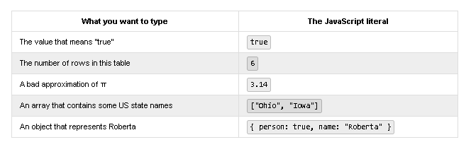
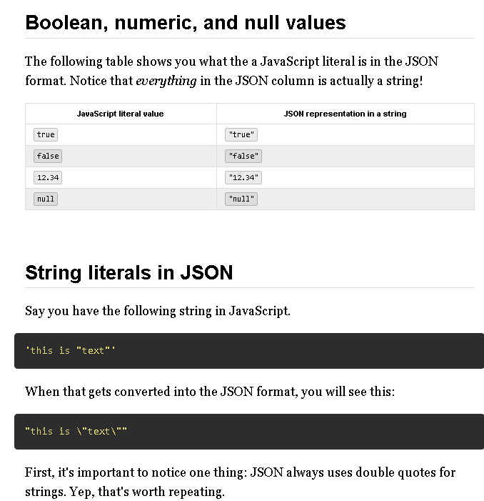
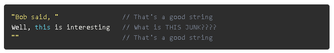

* JSON always uses double-quotes to mark strings.
* Notice also that the quotation marks (") are "escaped".
* #### what happens when your string needs to include a quotation mark

```
// This is a bad string with quotes in it
"Bob said, "Well, this is interesting.""
```

* #### Whatever computer is looking at that string gets really confused because once it reads that first quotation mark it's looking for another quotation mark to show where the string ends.



*If your quotation mark delimited string has a quotation mark in it, put a backslash before the interior quotation mark.*

Following that rule, you would correctly write the previous string like this.

```
"Bob said, \"Well, this is interesting.\""
```

The <b>`String`</b> object is used to represent and manipulate a sequence
of characters.

## Description

Strings are useful for holding data that can be represented in text
form. Some of the most-used operations on strings are to check their
[`length`](https://developer.mozilla.org/en-US/docs/Web/JavaScript/Reference/Global_Objects/String/length),
to build and concatenate them using the [+ and += string](https://developer.mozilla.org/en-US/docs/Web/JavaScript/Reference/Operators/String_Operators)
[operators](https://developer.mozilla.org/en-US/docs/Web/JavaScript/Reference/Operators/String_Operators),
checking for the existence or location of substrings with the
[`indexOf()`](https://developer.mozilla.org/en-US/docs/Web/JavaScript/Reference/Global_Objects/String/indexOf)
method, or extracting substrings with the
[`substring()`](https://developer.mozilla.org/en-US/docs/Web/JavaScript/Reference/Global_Objects/String/substring)
method.

### Creating strings 

Strings can be created as primitives, from string literals, or as objects, using the [`String()`](https://developer.mozilla.org/en-US/docs/Web/JavaScript/Reference/Global_Objects/String/String)
constructor:

``` {.syntaxbox.notranslate}
const string1 = "A string primitive";
const string2 = 'Also a string primitive';
const string3 = `Yet another string primitive`;
```

``` {.syntaxbox.notranslate}
const string4 = new String("A String object");
```

String primitives and string objects can be used interchangeably in most
situations. See "[String primitives and String](https://developer.mozilla.org/en-US/docs/Web/JavaScript/Reference/Global_Objects/String#String_primitives_and_String_objects)
[objects](https://developer.mozilla.org/en-US/docs/Web/JavaScript/Reference/Global_Objects/String#String_primitives_and_String_objects)"
below.

String literals can be specified using single or double quotes, which
are treated identically, or using the backtick character \`. This last
form specifies a [template](https://developer.mozilla.org/en-US/docs/Web/JavaScript/Reference/Template_literals)
[literal](https://developer.mozilla.org/en-US/docs/Web/JavaScript/Reference/Template_literals):
with this form you can interpolate expressions.

### Character access 

There are two ways to access an individual character in a string. The
first is the
[`charAt()`](https://developer.mozilla.org/en-US/docs/Web/JavaScript/Reference/Global_Objects/String/charAt)
method:

``` {.brush:.js .notranslate .line-numbers .language-js}
return 'cat'.charAt(1) // returns "a"
```

The other way (introduced in ECMAScript 5) is to treat the string as an
array-like object, where individual characters correspond to a numerical
index:

``` {.brush:.js .notranslate .line-numbers .language-js}
return 'cat'[1] // returns "a"
```

When using bracket notation for character access, attempting to delete
or assign a value to these properties will not succeed. The properties
involved are neither writable nor configurable. (See
[`Object.defineProperty()`](https://developer.mozilla.org/en-US/docs/Web/JavaScript/Reference/Global_Objects/Object/defineProperty)
for more information.)

### Comparing strings 

In C, the `strcmp()` function is used for comparing strings. In
JavaScript, you just use the [less-than and greater-than](https://developer.mozilla.org/en-US/docs/Web/JavaScript/Reference/Operators/Comparison_Operators)
[operators](https://developer.mozilla.org/en-US/docs/Web/JavaScript/Reference/Operators/Comparison_Operators):

``` {.brush:.js .notranslate .line-numbers .language-js}
let a = 'a'
let b = 'b'
if (a < b) { // true
  console.log(a + ' is less than ' + b)
} else if (a > b) {
  console.log(a + ' is greater than ' + b)
} else {
  console.log(a + ' and ' + b + ' are equal.')
}
```

A similar result can be achieved using the
[`localeCompare()`](https://developer.mozilla.org/en-US/docs/Web/JavaScript/Reference/Global_Objects/String/localeCompare)
method inherited by `String` instances.

Note that `a == b` compares the strings in `a` and `b` for being equal
in the usual case-sensitive way. If you wish to compare without regard
to upper or lower case characters, use a function similar to this:

``` {.notranslate.line-numbers .language-html}
function isEqual(str1, str2)
{
    return str1.toUpperCase() === str2.toUpperCase()
} // isEqual
```

Upper case is used instead of lower case in this function, due to
problems with certain UTF-8 character conversions.

### String primitives and String objects {#String\_primitives\_and\_String\_objects}

Note that JavaScript distinguishes between `String` objects and
[primitive](https://developer.mozilla.org/en-US/docs/Glossary/Primitive)
[string](https://developer.mozilla.org/en-US/docs/Glossary/Primitive)
values. (The same is true of
[`Boolean`](https://developer.mozilla.org/en-US/docs/Web/JavaScript/Reference/Global_Objects/Boolean)
and
[`Numbers`](https://developer.mozilla.org/en-US/docs/Web/JavaScript/Reference/Global_Objects/Number).)

String literals (denoted by double or single quotes) and strings
returned from `String` calls in a non-constructor context (that is,
called without using the
[`new`](https://developer.mozilla.org/en-US/docs/Web/JavaScript/Reference/Operators/new)
keyword) are primitive strings. JavaScript automatically converts
primitives to `String` objects, so that it's possible to use `String`
object methods for primitive strings. In contexts where a method is to
be invoked on a primitive string or a property lookup occurs, JavaScript
will automatically wrap the string primitive and call the method or
perform the property lookup.

``` {.brush:.js .notranslate .line-numbers .language-js}
let s_prim = 'foo'
let s_obj = new String(s_prim)

console.log(typeof s_prim) // Logs "string"
console.log(typeof s_obj)  // Logs "object"
```

String primitives and `String` objects also give different results when
using
[`eval()`](https://developer.mozilla.org/en-US/docs/Web/JavaScript/Reference/Global_Objects/eval).
Primitives passed to `eval` are treated as source code; `String` objects
are treated as all other objects are, by returning the object. For
example:

``` {.brush:.js .notranslate .line-numbers .language-js}
let s1 = '2 + 2'              // creates a string primitive
let s2 = new String('2 + 2')  // creates a String object
console.log(eval(s1))         // returns the number 4
console.log(eval(s2))         // returns the string "2 + 2"
```

For these reasons, the code may break when it encounters `String`
objects when it expects a primitive string instead, although generally,
authors need not worry about the distinction.

A `String` object can always be converted to its primitive counterpart
with the
[`valueOf()`](https://developer.mozilla.org/en-US/docs/Web/JavaScript/Reference/Global_Objects/String/valueOf)
method.

``` {.brush:.js .notranslate .line-numbers .language-js}
console.log(eval(s2.turns the number 4
```

### Escape notation


- - -

### Long literal strings 

Sometimes, your code will include strings which are very long. Rather
than having lines that go on endlessly, or wrap at the whim of your
editor, you may wish to specifically break the string into multiple
lines in the source code without affecting the actual string contents.
There are two ways you can do this.

#### Method 1 

You can use the
[+](https://developer.mozilla.org/en-US/docs/Web/JavaScript/Reference/Operators/Addition)
operator to append multiple strings together, like this:

``` {.brush:.js .notranslate .line-numbers .language-js}
let longString = "This is a very long string which needs " +
                 "to wrap across multiple lines because " +
                 "otherwise my code is unreadable."
```

#### Method 2 

You can use the backslash character (`\`) at the end of each line to
indicate that the string will continue on the next line. Make sure there
is no space or any other character after the backslash (except for a
line break), or as an indent; otherwise it will not work.

That form looks like this:

``` {.brush:.js .notranslate .line-numbers .language-js}
let longString = "This is a very long string which needs \
to wrap across multiple lines because \
otherwise my code is unreadable."
```

Both of the above methods result in identical strings.

## Constructor

[`String()`](https://developer.mozilla.org/en-US/docs/Web/JavaScript/Reference/Global_Objects/String/String)
: Creates a new `String` object. It performs type conversion when
called as a function, rather than as a constructor, which is usually
more useful.

## Static methods

[`String.fromCharCode(num1 \[, ...\[, numN\]\])`](https://developer.mozilla.org/en-US/docs/Web/JavaScript/Reference/Global_Objects/String/fromCharCode)
: Returns a string created by using the specified sequence of Unicode
values.
[`String.fromCodePoint(num1 \[, ...\[, numN)`](https://developer.mozilla.org/en-US/docs/Web/JavaScript/Reference/Global_Objects/String/fromCodePoint)
: Returns a string created by using the specified sequence of code
points.
[`String.raw()`](https://developer.mozilla.org/en-US/docs/Web/JavaScript/Reference/Global_Objects/String/raw)
: Returns a string created from a raw template string.

## Instance properties

[`String.prototype.length`](https://developer.mozilla.org/en-US/docs/Web/JavaScript/Reference/Global_Objects/String/length)
: Reflects the `length` of the string. Read-only.

## Instance methods

[`String.prototype.charAt(index)`](https://developer.mozilla.org/en-US/docs/Web/JavaScript/Reference/Global_Objects/String/charAt)
: Returns the character (exactly one UTF-16 code unit) at the
specified `index`.
[`String.prototype.charCodeAt(index)`](https://developer.mozilla.org/en-US/docs/Web/JavaScript/Reference/Global_Objects/String/charCodeAt)
: Returns a number that is the UTF-16 code unit value at the given
`index`.
[`String.prototype.codePointAt(pos)`](https://developer.mozilla.org/en-US/docs/Web/JavaScript/Reference/Global_Objects/String/codePointAt)
: Returns a nonnegative integer Number that is the code point value of
the UTF-16 encoded code point starting at the specified `pos`.
[`String.prototype.concat(str \[, ...strN \])`](https://developer.mozilla.org/en-US/docs/Web/JavaScript/Reference/Global_Objects/String/concat)
: Combines the text of two (or more) strings and returns a new string.
[`String.prototype.includes(searchString \[, position\])`](https://developer.mozilla.org/en-US/docs/Web/JavaScript/Reference/Global_Objects/String/includes)
: Determines whether the calling string contains `searchString`.
[`String.prototype.endsWith(searchString \[, length\])`](https://developer.mozilla.org/en-US/docs/Web/JavaScript/Reference/Global_Objects/String/endsWith)
: Determines whether a string ends with the characters of the string
`searchString`.
[`String.prototype.indexOf(searchValue \[, fromIndex\])`](https://developer.mozilla.org/en-US/docs/Web/JavaScript/Reference/Global_Objects/String/indexOf)
: Returns the index within the calling
[`String`](https://developer.mozilla.org/en-US/docs/Web/JavaScript/Reference/Global_Objects/String)
object of the first occurrence of `searchValue`, or `-1` if not
found.
[`String.prototype.lastIndexOf(searchValue \[, fromIndex\])`](https://developer.mozilla.org/en-US/docs/Web/JavaScript/Reference/Global_Objects/String/lastIndexOf)
: Returns the index within the calling
[`String`](https://developer.mozilla.org/en-US/docs/Web/JavaScript/Reference/Global_Objects/String)
object of the last occurrence of `searchValue`, or `-1` if not
found.
[`String.prototype.localeCompare(compareString \[, locales \[, options\]\])`](https://developer.mozilla.org/en-US/docs/Web/JavaScript/Reference/Global_Objects/String/localeCompare)
: Returns a number indicating whether the reference string
`compareString` comes before, after, or is equivalent to the given
string in sort order.
[`String.prototype.match(regexp)`](https://developer.mozilla.org/en-US/docs/Web/JavaScript/Reference/Global_Objects/String/match)
: Used to match regular expression `regexp` against a string.
[`String.prototype.matchAll(regexp)`](https://developer.mozilla.org/en-US/docs/Web/JavaScript/Reference/Global_Objects/String/matchAll)
: Returns an iterator of all `regexp`'s matches.
[`String.prototype.normalize(\[form\])`](https://developer.mozilla.org/en-US/docs/Web/JavaScript/Reference/Global_Objects/String/normalize)
: Returns the Unicode Normalization Form of the calling string value.
[`String.prototype.padEnd(targetLength \[, padString\])`](https://developer.mozilla.org/en-US/docs/Web/JavaScript/Reference/Global_Objects/String/padEnd)
: Pads the current string from the end with a given string and returns
a new string of the length `targetLength`.
[`String.prototype.padStart(targetLength \[, padString\])`](https://developer.mozilla.org/en-US/docs/Web/JavaScript/Reference/Global_Objects/String/padStart)
: Pads the current string from the start with a given string and
returns a new string of the length `targetLength`.
[`String.prototype.repeat(count)`](https://developer.mozilla.org/en-US/docs/Web/JavaScript/Reference/Global_Objects/String/repeat)
: Returns a string consisting of the elements of the object repeated
`count` times.
[`String.prototype.replace(searchFor, replaceWith)`](https://developer.mozilla.org/en-US/docs/Web/JavaScript/Reference/Global_Objects/String/replace)
: Used to replace occurrences of `searchFor` using `replaceWith`.
`searchFor` may be a string or Regular Expression, and `replaceWith`
may be a string or function.
[`String.prototype.replaceAll(searchFor, replaceWith)`](https://developer.mozilla.org/en-US/docs/Web/JavaScript/Reference/Global_Objects/String/replaceAll)
: Used to replace all occurrences of `searchFor` using `replaceWith`.
`searchFor` may be a string or Regular Expression, and `replaceWith`
may be a string or function.
[`String.prototype.search(regexp)`](https://developer.mozilla.org/en-US/docs/Web/JavaScript/Reference/Global_Objects/String/search)
: Search for a match between a regular expression `regexp` and the
calling string.
[`String.prototype.slice(beginIndex\[, endIndex\])`](https://developer.mozilla.org/en-US/docs/Web/JavaScript/Reference/Global_Objects/String/slice)
: Extracts a section of a string and returns a new string.
[`String.prototype.split(\[sep \[, limit\] \])`](https://developer.mozilla.org/en-US/docs/Web/JavaScript/Reference/Global_Objects/String/split)
: Returns an array of strings populated by splitting the calling
string at occurences of the substring `sep`.
[`String.prototype.startsWith(searchString \[, length\])`](https://developer.mozilla.org/en-US/docs/Web/JavaScript/Reference/Global_Objects/String/startsWith)
: Determines whether the calling string begins with the characters of
string `searchString`.
[`String.prototype.substr()`](https://developer.mozilla.org/en-US/docs/Web/JavaScript/Reference/Global_Objects/String/substr)
: Returns the characters in a string beginning at the specified
location through the specified number of characters.
[`String.prototype.substring(indexStart \[, indexEnd\])`](https://developer.mozilla.org/en-US/docs/Web/JavaScript/Reference/Global_Objects/String/substring)
: Returns a new string containing characters of the calling string
from (or between) the specified index (or indeces).
[`String.prototype.toLocaleLowerCase( \[locale, ...locales\])`](https://developer.mozilla.org/en-US/docs/Web/JavaScript/Reference/Global_Objects/String/toLocaleLowerCase)
: The characters within a string are converted to lowercase while
respecting the current locale.

```
For most languages, this will return the same as
[`toLowerCase()`](https://developer.mozilla.org/en-US/docs/Web/JavaScript/Reference/Global_Objects/String/toLowerCase).
```

[`String.prototype.toLocaleUpperCase( \[locale, ...locales\])`](https://developer.mozilla.org/en-US/docs/Web/JavaScript/Reference/Global_Objects/String/toLocaleUpperCase)
: The characters within a string are converted to uppercase while
respecting the current locale.

```
For most languages, this will return the same as
[`toUpperCase()`](https://developer.mozilla.org/en-US/docs/Web/JavaScript/Reference/Global_Objects/String/toUpperCase).
```

[`String.prototype.toLowerCase()`](https://developer.mozilla.org/en-US/docs/Web/JavaScript/Reference/Global_Objects/String/toLowerCase)
: Returns the calling string value converted to lowercase.
[`String.prototype.toString()`](https://developer.mozilla.org/en-US/docs/Web/JavaScript/Reference/Global_Objects/String/toString)
: Returns a string representing the specified object. Overrides the
[`Object.prototype.toString()`](https://developer.mozilla.org/en-US/docs/Web/JavaScript/Reference/Global_Objects/Object/toString)
method.
[`String.prototype.toUpperCase()`](https://developer.mozilla.org/en-US/docs/Web/JavaScript/Reference/Global_Objects/String/toUpperCase)
: Returns the calling string value converted to uppercase.


## Examples

### String conversion

It's possible to use `String` as a more reliable
[`toString()`](https://developer.mozilla.org/en-US/docs/Web/JavaScript/Reference/Global_Objects/String/toString)
alternative, as it works when used on
[`null`](https://developer.mozilla.org/en-US/docs/Web/JavaScript/Reference/Global_Objects/null),
[`undefined`](https://developer.mozilla.org/en-US/docs/Web/JavaScript/Reference/Global_Objects/undefined),
and on
[`symbols`](https://developer.mozilla.org/en-US/docs/Web/JavaScript/Reference/Global_Objects/Symbol).
For example:

``` {.brush:.js .notranslate .line-numbers .language-js}
let outputStrings = []
for (let i = 0, n = inputValues.length; i < n; ++i) {
  outputStrings.push(String(inputValues[i]));
}
```
==========================================================================================
# Reading Continued:

* # JSON only allows strings to be on one line

She woke him up with
her Ramones ringtone "I Want
to be Sedated"

* If you want to format that in a string in JSON format, you have to escape the quotation marks and the new lines!

```She woke him up with\nher Ramones ringtone "I Want\nto be Sedated"/```

**The new lines are replaced with "\n"**.
