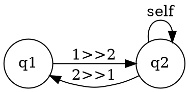

```graphviz
digraph finite_state_machine {
    rankdir=LR;
    size="8,5"

    node [shape = circle];


    q1 -> q2 [ label = "1>>2" ];
    q2 -> q1 [ label = "2>>1" ];
    q2 -> q2 [ label = "self" ];
}
```
