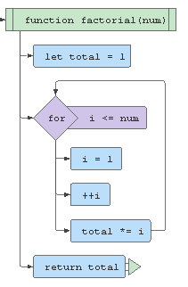
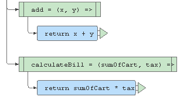

memoisation is an optimization technique used primarily to speed up computer programs by storing the results of expensive function calls and returning the cached result when the same inputs occur again


**A pure function is a function that meets the following criteria:**


**It is a function that always returns the same result when the arguments are the same**. 
- For example, the following functions are impure:
1. Functions which use random numbers.
2. Functions which use date time as seed to generate the result.
- It is a function that does not produce side-effects in the application:
1. Data mutation or change application state.
2. Network request.
3. Database or file request.
4. Obtaining user input.
5. Querying the DOM.


- main pure function benefits are:
1. Your code is more declarative, which is focused on what must be done and not on how to do it. Also, the functions are focused on how different inputs are related to outputs.
1. The code is more testable, and finding bugs is easier than in impure functions.


### Pure Functions Example
Recursive functions frequently use pure functions. The most classical recursive problem is the factorial.


```js

function factorial( num ) {
    if ( num === 0 ) {
        return 1;
    } else {
        return num * factorial( n - 1 );
    }
}
```


**the imperative version of the function factorial is pure too, because the pure functions are related to inputs and outputs. In both cases, when the input is the same the output will be the same.**





```js
const add = ( x, y ) => x + y;
const calculateBill =( sumOfCart, tax)=> sumOfCart * tax;

```


## Memoization in Recursive Functions

--> Memoization is the programming technique which allows you to not recalculate the value of the pure function.

I.e., the pure function returns the same value when it has the same inputs. So, the value return can be stored in the system using any cache system (for example a map or array).


if you calculate the value of factorial(1) you can store the return value 1 and the same action can be done in each execution. So, when you run the factorial(100), you take a while the first time but the second time and other times after that, the time will be reduced!
